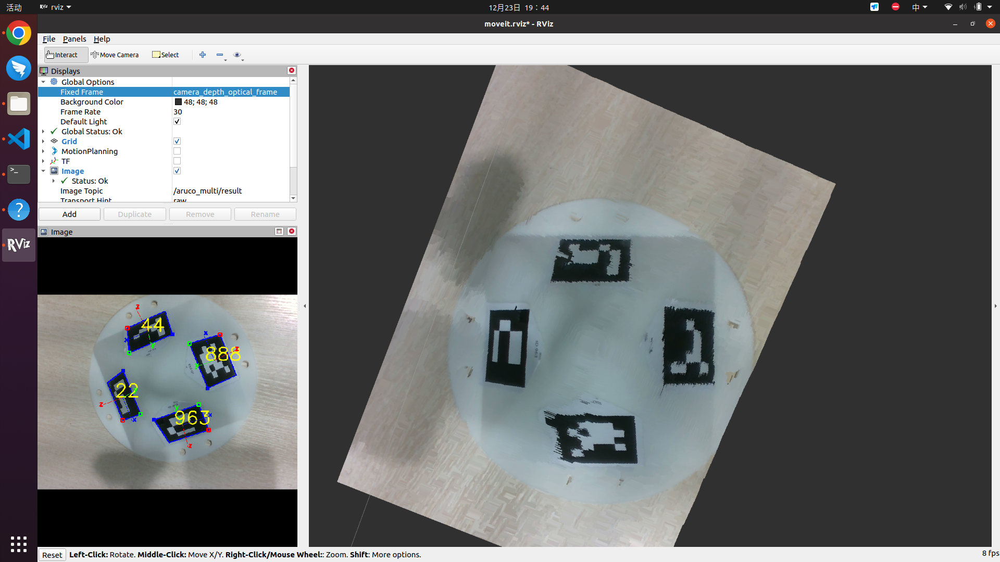
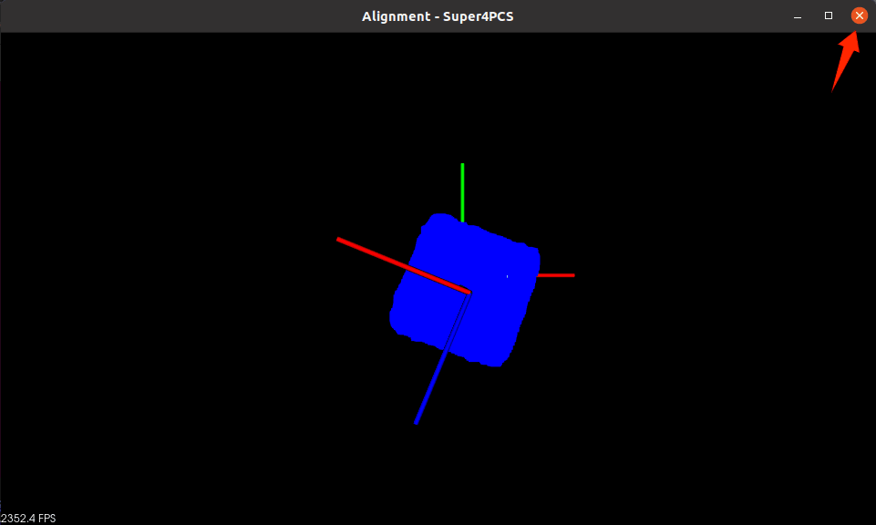
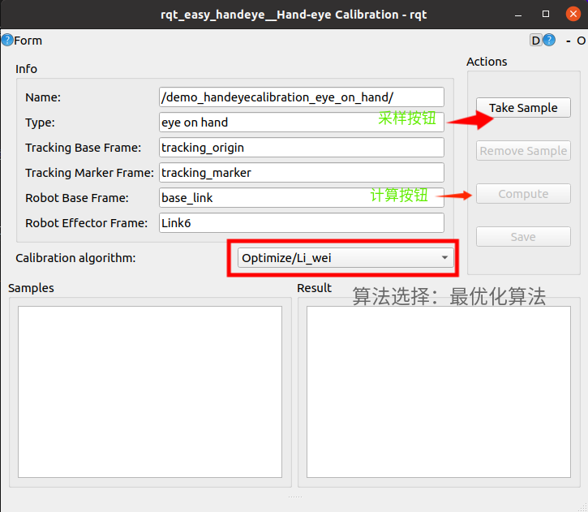

# 基于点云ICP配准与非线性优化的眼在手上标定
## 介绍
该代码是基于ICP匹配与非线性优化的眼在手上标定，使用睿尔曼机械臂以及Realsense相机进行标定。经过测试，标定误差在1.5mm之内。环境:Ubuntu20.04(x86) ,Ros-noetic。
## 环境配置
第一步配置
```
git clone --recursive https://github.com/STORM-IRIT/OpenGR.git
cd OpenGR
mkdir build
cd build
cmake ..
make
```
安装librealsense
```
sudo apt-get install librealsense2-dkms
sudo apt-get install librealsense2-utils
```
创建工作空间
```
cd ($ 你的工作空间)/src
git clone https://github.com/IntelRealSense/realsense-ros.git -b ros1-legacy
git clone https://github.com/RealManRobot/rm_robot.git
git clone https://github.com/Michael-Duan-geek/icp-handeye.git
catkin build rm_msgs
#全部编译之前修改3dposedetection的CMakeLists.txt中的OpenGR_DIR为刚刚编译OpenGR的builld文件路径
catkin build 
```
## 代码原理及误差分析
 - 由于相机的图像存在畸变等问题，会导致二维码的识别产生较大的误差，常规的使用aruco做识别的时候会导致产生很大的误差。
采用ICP将环境点云与物体的点云做配准，可以获得更加准确的标定物的位置。
标定物如图所示，标定物的四周贴了二维码，二维码是提供一个较为准确的先验姿态，随后使用icp计算出更为准确的姿态
 - 采用Tsai等两步法进行计算标定矩阵时，由于该方法是先计算旋转矩阵，再将旋转矩阵带入计算平移向量。
   此方法容易将旋转矩阵的误差所带来的放大，导致平移向量的不精准。可以依据最优化理论，采用凸松弛全局优化机器人手眼标定的方法，替代Tsai进行求解。具体原理可以查看论文
## 准备工作
 - 3D打印标定块(qr_code_icp/prepareddata/biaodingkuai3.stl)，建议打印哑光的材质，因为realsense反光强烈的时候，点云会发生波动

 - 从网络上下载二维码，类型为oringl aruco ,id 号为22，44，888，963，以及大小均为0.06m
 >二维码下载网站：https://chev.me/arucogen/
 - 将二维码 剪裁，贴在标定板的四个面上，一定注意顺序，参考下图
 
## 使用教程
以65机械臂标定为例
首先启动机械臂的相关节点
```
roslaunch rm_control rm_65_control.launch 
roslaunch rm_bringup rm_65_robot.launch
```
启动相机相关的节点
```
roslaunch realsense2_camera rs_camera.launch filters:=pointcloud align_depth:=true
```
启动二维码识别
```
roslaunch aruco_ros multi.launch
```
启动easy_handeye
```
roslaunch easy_handeye calibrate_depth.launch
```
将标定块放入摄像机视野范围内，并确保视野内不出现任何其他杂物,不要出现其他的点云



启动配准程序
```
rosrun 3dposedetection calibration
```
查看PCL输出的窗口，观察配准情况蓝色为模型点云，白色为环境点云


检查无误后，点击窗口的关闭按钮

此时代码会输出标定块的tf，点击easy_handeye的采样按钮即可

换一个姿态，需要重新运行配准程序，然后采样。
采样15个点足够已经足够计算，选择算法为Optimize/Li_wei,点击compute输出计算的结果

注意最终的计算结果是图像原初坐标系camera_color_optical_frame基于机械臂末端的变换
## easy_handlaunch的相关配置解析
easy_handeye/easy_handeye/launch/eye_on_hand/calibrate_depth.launch
```xml
<launch>
    <!-- you can write your own calibrate.launch, by including the ROS drivers for robot and tracking and choosing
    your own namespace if you have multiple tracking devices or robots -->

    <arg name="start_simulator" default="true" doc="Start a simulated tracking system with a trivial noise model" />

    <arg name="namespace_prefix" default="demo_handeyecalibration" />
    <arg name="eye_on_hand" default="true" />

    <arg name="robot_base_frame" value="base_link" />
    <arg name="robot_effector_frame" value="Link6" />
    <arg name="tracking_base_frame" value="tracking_origin" />
    <arg name="tracking_marker_frame" value="tracking_marker" />
 　
 
    <!-- start easy_handeye calibration procedure -->
    <include file="$(find easy_handeye)/launch/calibrate.launch" >
        <arg name="start_rviz" value="false" />
        <arg name="move_group" default="arm" />
        <arg name="namespace_prefix" value="$(arg namespace_prefix)" />
        <arg name="eye_on_hand" value="$(arg eye_on_hand)" />
        <arg name="publish_dummy" value="false" /> <!-- in our case it is done by the tracking simulator -->

        <arg name="tracking_base_frame" value="$(arg tracking_base_frame)" />
        <arg name="tracking_marker_frame" value="$(arg tracking_marker_frame)" />
        <arg name="robot_base_frame" value="$(arg robot_base_frame)" />
        <arg name="robot_effector_frame" value="$(arg robot_effector_frame)" />

        <arg name="freehand_robot_movement" value="true" />
        <arg name="robot_velocity_scaling" value="0.5" />
        <arg name="robot_acceleration_scaling" value="0.2" />
    </include>
</launch>
```
 - eye_on_hand为是否为眼在手上
 - robot_effector_frame是机械臂的末端坐标系
 - robot_base_frame是机械臂的基底坐标系
 - tracking_base_frame是相机坐标系
 - tracking_marker是标定物的坐标系

 - freehand_robot_movement此处的设置是否使用自由拖动，设为false，会多出一个窗口，来自动规划点位，设为true则是自由拖动
 - robot_velocity_scaling和robot_acceleration_scaling是使用规划点位的速度和加速度设置

## 关键代码解释
### aruco_multi.cpp
 - 这个代码的原型是aruco_single,在此基础上，将代码中的部分进行了更改，会输出看到的所有二维码的tf，以及会旋转这些坐标系(修改了aruco_ros_utils.cpp的arucoMarker2Tf函数)
### handeye_calibration_backend_optimize.py
easy_handeye/easy_handeye/src/easy_handeye/handeye_calibration_backend_optimize.py
 - 这个代码是使用最优化算法作为后端计算的实现函数
 ``` python
import cv2
import numpy as np
import transforms3d as tfs
from rospy import logerr, logwarn, loginfo
from scipy.optimize import minimize
from easy_handeye.handeye_calibration import HandeyeCalibration
class HandeyeCalibrationBackendOptimize(object):
   MIN_SAMPLES = 2  # TODO: correct? this is what is stated in the paper, but sounds strange
   """Minimum samples required for a successful calibration."""

   AVAILABLE_ALGORITHMS = {
      'Li_wei'
   }

   # 非线性求解所需的定义目标函数
   def objective(x,A,B):
      q0, q1, q2, q3, t1, t2, t3 = x
      X = np.array([
         [q0**2 + q1**2 - q2**2 - q3**2, 2*(q1*q2 - q0*q3), 2*(q1*q3 + q0*q2), t1],
         [2*(q1*q2 + q0*q3), q0**2 - q1**2 + q2**2 - q3**2, 2*(q2*q3 - q0*q1), t2],
         [2*(q1*q3 - q0*q2), 2*(q2*q3 + q0*q1), q0**2 - q1**2 - q2**2 + q3**2, t3],
         [0, 0, 0, 1]
      ])
      error = 0
      for i in range(int(len(A))):
         error = error +  np.linalg.norm(A[i] @ X - X @ B[i],ord='fro') **2
      return np.sum(error)

   @staticmethod
   def _msg_to_opencv(transform_msg):
      cmt = transform_msg.translation
      tr = np.array((cmt.x, cmt.y, cmt.z))
      cmq = transform_msg.rotation
      rot = tfs.quaternions.quat2mat((cmq.w, cmq.x, cmq.y, cmq.z))
      return rot, tr

   @staticmethod
   def _get_opencv_samples(samples):
      """
      Returns the sample list as a rotation matrix and a translation vector.

      :rtype: (np.array, np.array)
      """
      hand_base_rot = []
      hand_base_tr = []
      marker_camera_rot = []
      marker_camera_tr = []

      for s in samples:
         camera_marker_msg = s['optical'].transform
         (mcr, mct) = HandeyeCalibrationBackendOptimize._msg_to_opencv(camera_marker_msg)
         marker_camera_rot.append(mcr)
         marker_camera_tr.append(mct)

         base_hand_msg = s['robot'].transform
         (hbr, hbt) = HandeyeCalibrationBackendOptimize._msg_to_opencv(base_hand_msg)
         hand_base_rot.append(hbr)
         hand_base_tr.append(hbt)

      return (hand_base_rot, hand_base_tr), (marker_camera_rot, marker_camera_tr)

   def compute_calibration(self, handeye_parameters, samples, algorithm=None):
      """
      Computes the calibration through the OpenCV library and returns it.

      :rtype: easy_handeye.handeye_calibration.HandeyeCalibration
      """
      if algorithm is None:
         algorithm = 'Li_wei'

      loginfo('Optimize backend calibrating with algorithm {}'.format(algorithm))

      if len(samples) < HandeyeCalibrationBackendOptimize.MIN_SAMPLES:
         logwarn("{} more samples needed! Not computing the calibration".format(
               HandeyeCalibrationBackendOptimize.MIN_SAMPLES - len(samples)))
         return

      # Update data
      opencv_samples = HandeyeCalibrationBackendOptimize._get_opencv_samples(samples)
      (hand_world_rot, hand_world_tr), (marker_camera_rot, marker_camera_tr) = opencv_samples

      if len(hand_world_rot) != len(marker_camera_rot):
         logerr("Different numbers of hand-world and camera-marker samples!")
         raise AssertionError

      loginfo("Computing from %g poses..." % len(samples))

      A = []
      B = []
      N = len(hand_world_rot)
      # 计算出AB矩阵
      for i in range(int(N)-1):

         T_tool_i = np.vstack([np.hstack([hand_world_rot[i],hand_world_tr[i].reshape(-1,1)]),[np.array([0,0,0,1])]])
         T_tool_i_next = np.vstack([np.hstack([hand_world_rot[i+1],hand_world_tr[i+1].reshape(-1,1)]),[np.array([0,0,0,1])]])
         A_i = np.linalg.inv(T_tool_i) @ T_tool_i_next
         A.append(A_i)

         T_cam_i = np.vstack([np.hstack([marker_camera_rot[i],marker_camera_tr[i].reshape(-1,1)]),[np.array([0,0,0,1])]])
         T_cam_i_next = np.vstack([np.hstack([marker_camera_rot[i+1],marker_camera_tr[i+1].reshape(-1,1)]),[np.array([0,0,0,1])]])
         B_i = T_cam_i @ np.linalg.inv(T_cam_i_next)
         B.append(B_i)

      # 初始猜测
      x0 = [1, 0, 0, 0,0,0,0]
      # 定义约束
      constraints = ({
         'type': 'eq',
         'fun': lambda x: np.linalg.norm(x[:4]) - 1  # 四元数归一化约束
      }, {
         'type': 'ineq',
         'fun': lambda x: 1 - np.linalg.norm(x[4:])  # 平移向量范数约束
      }
      )
      # 定义变量的范围
      bounds = [
         (-1, 1),  # q0 = qw
         (-1, 1),  # q1 = qx
         (-1, 1),  # q2 = qy
         (-1, 1),  # q3 = qz
         (None, None),  # t1 = tx
         (None, None),  # t2 = ty
         (None, None)   # t3 = tz
      ]
      # 求解
      sol = minimize(HandeyeCalibrationBackendOptimize.objective, x0, args=(A, B), bounds=bounds,constraints=constraints)
      loginfo(f"应用非线性优化的四元数是：\n {[sol.x[1],sol.x[2],sol.x[3],sol.x[0]]}\n")
      loginfo(f"应用非线性优化的平移向量是：\n {[sol.x[4],sol.x[5],sol.x[6]]}\n")
      # print(sol.x)
      loginfo(f"误差函数最小值是：\n {sol.fun}\n")

      result_tuple = ((sol.x[4],sol.x[5],sol.x[6]), (sol.x[1],sol.x[2],sol.x[3],sol.x[0]))

      ret = HandeyeCalibration(calibration_parameters=handeye_parameters,
                              transformation=result_tuple)
      return ret
 ```
 - 计算原理是  求几何误差( AX-XB的for范数的和，即||AX-XB||^2 )的最小值点，目标函数是个非线性函数，常规方法无法求解，故而采用最优化的方法进行求解，此方法称为一步法比Tsai这样的两步法(即先求旋转再求平移)精度更高
 - objective定义scipy使用的目标函数即FX = ∑(||AiX-XBi||^2)
 - compute_calibration为compute按钮按下时触发的函数，对目标函数FX求解最小值，函数中bounds定义了变量范围，x0是初始猜测(qw=1,其余为0)，sol.fun为误差函数的最小值，我们可以使用此来判断此次标定的好坏
### 3dpose_forcalibration.cpp
 - 代码的作用是进行3d点云配准，通过使用二维码作为先验的位姿，然后使用icp算法进行点云的配准，并输出标定块的坐标系的tf

下面这部分是使用二维码计算标定块的底座坐标，然后将模型的点云位置变换到由二维码计算的来的坐标
```cpp
   Eigen::Matrix4f transform_rotation_humanpredefined = Eigen::Matrix4f::Identity(); // 这个应该是二维码相对于物体坐标系的变换,先转动
   Eigen::AngleAxisf rollAngle(0, Eigen::Vector3f::UnitX());
   Eigen::AngleAxisf pitchAngle(0, Eigen::Vector3f::UnitY());
   Eigen::AngleAxisf yawAngle(0.78539816339745, Eigen::Vector3f::UnitZ());
   Eigen::Quaternionf q = yawAngle * pitchAngle * rollAngle;
   Eigen::Matrix3f mat3_humanpredefined = q.matrix();
   transform_rotation_humanpredefined.block(0, 0, 3, 3) = mat3_humanpredefined;

   Eigen::Matrix4f transform_trans_humanpredefined = Eigen::Matrix4f::Identity();
   transform_trans_humanpredefined(0, 3) = -0.065; // 应该是负的，这个应该是二维码相对于物体坐标系的变换,再移动
   transform_trans_humanpredefined(1, 3) = 0.02;

   Eigen::Matrix4f transform_rotation_calibration_final = Eigen::Matrix4f::Identity(); // 就不同二维码（贴了四周，各四个），需要再进行一次绕y的旋转
   Eigen::AngleAxisf rollAngle_final(0, Eigen::Vector3f::UnitX());
   Eigen::AngleAxisf pitchAngle_final(1.5707963267949 * multiples, Eigen::Vector3f::UnitY()); // 1.5707963267949*multiples
   Eigen::AngleAxisf yawAngle_final(0, Eigen::Vector3f::UnitZ());
   Eigen::Quaternionf q_final = yawAngle_final * pitchAngle_final * rollAngle_final;
   Eigen::Matrix3f mat3_humanpredefined_final = q_final.matrix();
   transform_rotation_calibration_final.block(0, 0, 3, 3) = mat3_humanpredefined_final;

   Eigen::Matrix3f mat3 = Eigen::Quaternionf(transform_aru_tf.getRotation().w(), transform_aru_tf.getRotation().x(), transform_aru_tf.getRotation().y(), transform_aru_tf.getRotation().z()).toRotationMatrix();
   Eigen::Matrix4f transform_aru = Eigen::Matrix4f::Identity();

   transform_aru.block(0, 0, 3, 3) = mat3;
   transform_aru(0, 3) = transform_aru_tf.getOrigin().x();
   transform_aru(1, 3) = transform_aru_tf.getOrigin().y();
   transform_aru(2, 3) = transform_aru_tf.getOrigin().z();
   transform_aru = transform_rotation_calibration_final * transform_trans_humanpredefined * transform_rotation_humanpredefined * transform_aru;
   // 计算之前得到的变换矩阵transform_aru的逆矩阵。
   Eigen::Matrix4f transform_aru_inv = transform_aru.inverse();
   // 应用变换矩阵把读取文件的点云ori_object_xyz进行变换，得到点云object_xyz。
   pcl::transformPointCloud(*ori_object_xyz, *object_xyz, transform_aru_inv);
   // 创建一个仿射变换对象listeningresult，用于在可视化中表示变换。
   Eigen::Affine3f listeningresult(transform_aru_inv);
   // 在PCLVisualizer对象visu中添加一个坐标系，以展示listeningresult表示的变换。
    visu.addCoordinateSystem(0.2, listeningresult);
```
下面这部分是通过环境点云与模型进行匹配，得到二者之间的变换
```cpp
   //设置最大迭代次数
   icp.setMaximumIterations(iterations);
   // 设置ICP算法的输入源点云为remaining_cloud，这通常是环境中的点云。
   icp.setInputSource(remaining_cloud);
   // 设置ICP算法的目标点云为object_xyz，这是已知模型或参考点云。
   icp.setInputTarget(object_xyz);
   pcl::console::print_highlight("Start Aligning ...\n");
   // 执行ICP算法，将remaining_cloud与object_xyz进行对齐，结果存储在remaining_cloud中。
   icp.align(*remaining_cloud); // 理论上应该是环境点云
   pcl::console::print_highlight("Stop Aligning...\n");
   
   //获取最终的配准结果并打印
   Eigen::Matrix4f transformation2 = icp.getFinalTransformation();
   pcl::console::print_info("    | %6.3f %6.3f %6.3f | \n", transformation2(0, 0), transformation2(0, 1), transformation2(0, 2));
   pcl::console::print_info("R = | %6.3f %6.3f %6.3f | \n", transformation2(1, 0), transformation2(1, 1), transformation2(1, 2));
   pcl::console::print_info("    | %6.3f %6.3f %6.3f | \n", transformation2(2, 0), transformation2(2, 1), transformation2(2, 2));
   pcl::console::print_info("\n");
   pcl::console::print_info("t = < %0.3f, %0.3f, %0.3f >\n", transformation2(0, 3), transformation2(1, 3), transformation2(2, 3));
   pcl::console::print_info("\n");

   pcl::console::print_info("remaining_cloud size, %d , %d \n", remaining_cloud->points.size(), object_xyz->points.size());
```
将配准得来的变换矩阵和二维码的变换矩阵进行组合即是最终的标定块位置的矩阵
```cpp
   Eigen::Matrix4f transformationfinal;
   //获取最终的标定块基于相机的位置
   transformationfinal = transformation2.inverse() * transform_aru_inv; // 因为之前ＩＣＰ写成了环境匹配模型，而不是模型匹配环境，所以要逆
   //打印结果，并保存最终结果
   pcl::console::print_info("    | %6.3f %6.3f %6.3f | \n", transformationfinal(0, 0), transformationfinal(0, 1), transformationfinal(0, 2));
   pcl::console::print_info("R = | %6.3f %6.3f %6.3f | \n", transformationfinal(1, 0), transformationfinal(1, 1), transformationfinal(1, 2));
   pcl::console::print_info("    | %6.3f %6.3f %6.3f | \n", transformationfinal(2, 0), transformationfinal(2, 1), transformationfinal(2, 2));
   pcl::console::print_info("\n");
   pcl::console::print_info("t = < %0.3f, %0.3f, %0.3f >\n", transformationfinal(0, 3), transformationfinal(1, 3), transformationfinal(2, 3));
   pcl::console::print_info("\n");
   transx = transformationfinal(0, 3);
   transy = transformationfinal(1, 3);
   transz = transformationfinal(2, 3);

   Eigen::Matrix3f rotation_final;
   rotation_final << transformationfinal(0, 0), transformationfinal(0, 1), transformationfinal(0, 2),
      transformationfinal(1, 0), transformationfinal(1, 1), transformationfinal(1, 2),
      transformationfinal(2, 0), transformationfinal(2, 1), transformationfinal(2, 2);

   q_r_final = rotation_final;
   // 使用最终变换矩阵变换原始模型点云，得到配准后的点云。
   pcl::transformPointCloud(*ori_object_xyz, *final_model, transformationfinal);
```