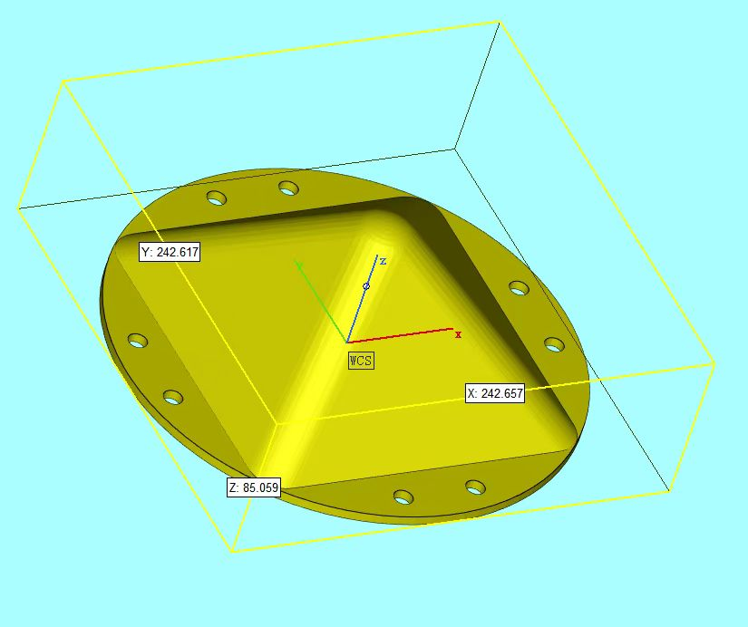
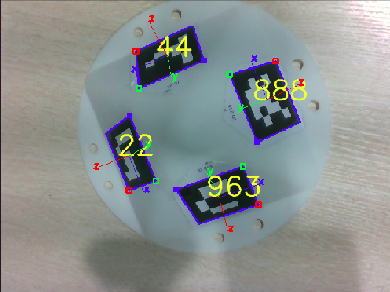
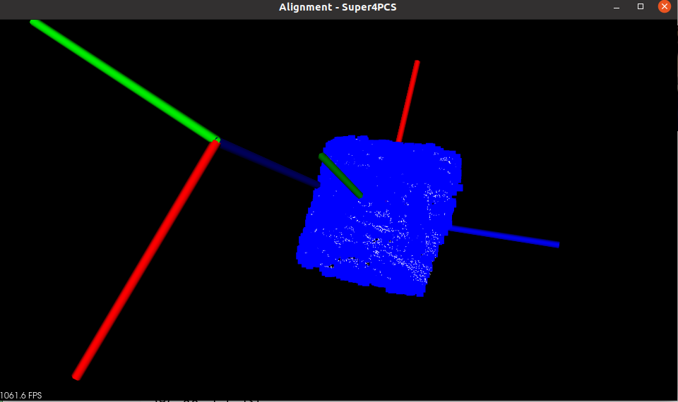
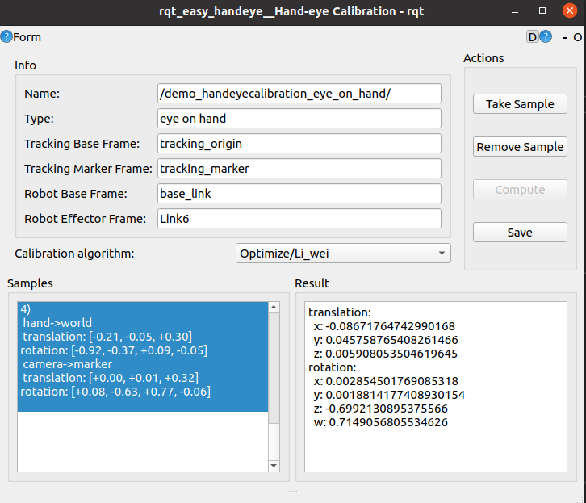

# 基于点云ICP配准与非线性优化的眼在手上标定
## 介绍
该代码是基于ICP匹配与非线性优化的眼在手上标定，使用睿尔曼机械臂以及Realsense相机进行标定。经过测试，标定误差在1.5mm之内。环境:Ubuntu20.04(x86) ,Ros-noetic。
## 环境配置
第一步配置
```
git clone --recursive https://github.com/STORM-IRIT/OpenGR.git
cd OpenGR
mkdir build
cd build
cmake ..
make
```
安装librealsense
```
sudo apt-get install librealsense2-dkms
sudo apt-get install librealsense2-utils
```
创建工作空间
```
cd ($ 你的工作空间)/src
git clone https://github.com/IntelRealSense/realsense-ros.git -b ros1-legacy
git clone https://github.com/RealManRobot/rm_robot.git
git clone https://github.com/Michael-Duan-geek/icp-handeye.git
catkin build rm_msgs
#全部编译之前修改3dposedetection的CMakeLists.txt中的OpenGR_DIR为刚刚编译OpenGR的builld文件路径
catkin build 
```
## 代码原理及误差分析
 - 由于相机的图像存在畸变等问题，会导致二维码的识别产生较大的误差，常规的使用aruco做识别的时候会导致产生很大的误差。
采用ICP将环境点云与物体的点云做配准，可以获得更加准确的标定物的位置。
标定物如图所示，标定物的四周贴了二维码，二维码是提供一个较为准确的先验姿态，随后使用icp计算出更为准确的姿态
 - 采用Tsai等两步法进行计算标定矩阵时，由于该方法是先计算旋转矩阵，再将旋转矩阵带入计算平移向量。
   此方法容易将旋转矩阵的误差所带来的放大，导致平移向量的不精准。可以依据最优化理论，采用凸松弛全局优化机器人手眼标定的方法，替代Tsai进行求解。具体原理可以查看论文
## 准备工作
 - 3D打印标定块(qr_code_icp/prepareddata/biaodingkuai3.stl)，建议打印哑光的材质，因为realsense反光强烈的时候，点云会发生波动

 - 从网络上下载二维码，类型为oringl aruco ,id 号为22，44，888，963，以及大小均为0.06m
 >二维码下载网站：https://chev.me/arucogen/
 - 将二维码 剪裁，贴在标定板的四个面上，一定注意顺序，参考下图
 
## 使用教程
以65机械臂标定为例
首先启动机械臂的相关节点
```
roslaunch rm_control rm_65_control.launch 
roslaunch rm_bringup rm_65_robot.launch
```
启动相机相关的节点
```
roslaunch realsense2_camera rs_camera.launch filters:=pointcloud align_depth:=true
```
启动二维码识别
```
roslaunch aruco_ros multi.launch
```
启动easy_handeye
```
roslaunch easy_handeye calibrate_depth.launch
```
将标定块放入摄像机视野范围内，并确保视野内不出现任何其他杂物,不要出现其他的点云


启动配准程序
```
rosrun 3dposedetection calibration
```
查看PCL输出的窗口，观察配准情况蓝色为模型点云，白色为环境点云


检查无误后，点击窗口的关闭按钮

此时代码会输出标定块的tf，点击easy_handeye的采样按钮即可

换一个姿态，需要重新运行配准程序，然后采样。
采样15个点足够已经足够计算，选择算法为Optimize/Li_wei,点击compute输出计算的结果

注意最终的计算结果是图像原初坐标系camera_color_optical_frame基于机械臂末端的变换
## 代码结构
```python
src
├─ CMakeLists.txt
├─ aruco_ros
│  ├─ LICENSE
│  ├─ README.md 自述文件
│  ├─ aruco
│  ├─ aruco_msgs
│  └─ aruco_ros
│     ├─ CHANGELOG.rst
│     ├─ CMakeLists.txt
│     ├─ cfg
│     │  └─ ArucoThreshold.cfg
│     ├─ etc
│     ├─ include
│     │  └─ aruco_ros
│     │     └─ aruco_ros_utils.h #二维码识别依赖 #修改了此代码中的部分函数
│     ├─ launch
│     │  ├─ double.launch #两个二维码识别
│     │  ├─ marker_publisher.launch #多二维码识别
│     │  ├─ multi.launch #多个二维码识别且发布tf
│     │  └─ single.launch #单个二维码识别
│     ├─ package.xml
│     └─ src #识别源文件
│        ├─ aruco_ros_utils.cpp
│        ├─ marker_publish.cpp
│        ├─ multi.cpp #多二维码识别
│        ├─ simple_double.cpp
│        └─ simple_single.cpp
├─ easy_handeye
│  ├─ LICENSE.md
│  ├─ README.md
│  ├─ docs#相关文档
│  ├─ easy_handeye
│  │  ├─ CMakeLists.txt
│  │  ├─ README.md
│  │  ├─ launch
│  │  │  ├─ calibrate.launch
│  │  │  ├─ calibrate_test.launch
│  │  │  ├─ eye_on_hand #眼在手上使用二维码标定
│  │  │  │  ├─ calibrate_depth.launch
│  │  │  │  ├─ rm_65_aruco_582_on_hand.launch
│  │  │  │  └─ rm_65_calibrate_on_hand.launch
│  │  │  ├─ eye_to_hand #眼在手外使用二维码标定
│  │  │  │  ├─ rm_65_aruco_582_to_hand.launch
│  │  │  │  └─ rm_65_calibrate_to_hand.launch
│  │  │  ├─ publish.launch
│  │  │  ├─ rqt_easy_handeye.perspective
│  │  │  └─ rviz_easy_handeye.config
│  │  ├─ package.xml
│  │  ├─ scripts #标定程序
│  │  │  ├─ calibrate.py
│  │  │  ├─ handeye_calibration_commander.py
│  │  │  ├─ publish.py
│  │  │  └─ robot.py
│  │  ├─ setup.py
│  │  └─ src
│  │     └─ easy_handeye
│  │        ├─ __init__.py
│  │        ├─ handeye_calibration.py
│  │        ├─ handeye_calibration_backend_opencv.py #opencv标定计算后端
│  │        ├─ handeye_calibration_backend_optimize.py #基于凸优化的标定计算后端
│  │        ├─ handeye_client.py
│  │        ├─ handeye_robot.py
│  │        ├─ handeye_sampler.py
│  │        ├─ handeye_server.py
│  │        └─ handeye_server_robot.py
│  ├─ easy_handeye_msgs #相关的消息
│  │  ├─ CMakeLists.txt
│  │  ├─ msg
│  │  │  ├─ HandeyeCalibration.msg
│  │  │  ├─ SampleList.msg
│  │  │  └─ TargetPoseList.msg
│  │  ├─ package.xml
│  │  └─ srv
│  │     ├─ calibration
│  │     │  ├─ ComputeCalibration.srv
│  │     │  ├─ ListAlgorithms.srv
│  │     │  ├─ RemoveSample.srv
│  │     │  ├─ SetAlgorithm.srv
│  │     │  └─ TakeSample.srv
│  │     └─ robot_movements
│  │        ├─ CheckStartingPose.srv
│  │        ├─ EnumerateTargetPoses.srv
│  │        ├─ ExecutePlan.srv
│  │        ├─ PlanToSelectedTargetPose.srv
│  │        └─ SelectTargetPose.srv
│  └─ rqt_easy_handeye #qt界面
│     ├─ CMakeLists.txt
│     ├─ README.md
│     ├─ package.xml
│     ├─ plugin.xml
│     ├─ resource
│     │  ├─ rqt_handeye.ui
│     │  ├─ rqt_handeye_evaluator.ui
│     │  └─ rqt_handeye_info.ui
│     ├─ scripts
│     │  ├─ rqt_calibration_evaluator
│     │  ├─ rqt_calibrationmovements
│     │  └─ rqt_easy_handeye
│     ├─ setup.py
│     └─ src
│        └─ rqt_easy_handeye
│           ├─ __init__.py
│           ├─ rqt_calibration_evaluator.py
│           ├─ rqt_calibrationmovements.py
│           └─ rqt_easy_handeye.py
├─ qr_code_icp
│  ├─ prepareddata
│  │  ├─ biaodingkuai3.stl
│  │  └─ qrcodes.zip
│  └─ src
│     └─ 3dposedetection # icp匹配的节点源代码
│        ├─ CMakeLists.txt
│        ├─ demo-utils.h
│        ├─ model_pcd #标定块的模型
│        │  ├─ calibblockthird.mtl
│        │  ├─ calibblockthird.obj
│        │  └─ pc_color.pcd
│        ├─ package.xml
│        └─ pcl #pcl相关依赖
│           └─ registration
│              ├─ impl
│              │  └─ super4pcs.hpp
│              └─ super4pcs.h
├─ realsense-ros #realsense相机相关
└─ rm_control #睿尔曼控制ros包
   ├─ README.md #自述文件
   ├─ rm_bringup #启动机械臂的launch
   │  ├─ CMakeLists.txt
   │  ├─ launch
   │  │  ├─ rm_63_6f_robot.launch
   │  │  ├─ rm_63_robot.launch
   │  │  ├─ rm_65_6f_robot.launch
   │  │  ├─ rm_65_robot.launch
   │  │  ├─ rm_75_6f_robot.launch
   │  │  ├─ rm_75_robot.launch
   │  │  ├─ rm_eco65_6f_robot.launch
   │  │  └─ rm_eco65_robot.launch
   │  └─ package.xml
   ├─ rm_control #moveit控制的server端
   │  ├─ CMakeLists.txt
   │  ├─ launch
   │  │  ├─ rm_63_control.launch
   │  │  ├─ rm_65_control.launch
   │  │  ├─ rm_75_control.launch
   │  │  └─ rm_eco65_control.launch
   │  ├─ package.xml
   │  └─ src
   │     ├─ cubicSpline.h
   │     ├─ play_audio.cpp
   │     ├─ rm_control.cpp
   │     └─ voice_control.wav
   ├─ rm_description #机械臂模型
   │  ├─ CMakeLists.txt
   │  ├─ config
   │  ├─ launch
   │  ├─ meshes#stl模型文件夹
   │  ├─ package.xml
   │  └─ urdf #urdf文件夹
   ├─ rm_doc #相关文档
   │  ├─ CMakeLists.txt
   │  ├─ doc
   │  │  └─ 睿尔曼机械臂ROS使用说明书_V1.7.pdf
   │  └─ package.xml
   ├─ rm_driver #机械臂的驱动
   │  ├─ CMakeLists.txt
   │  ├─ agv_demo.py
   │  ├─ launch
   │  │  ├─ rm_63_driver.launch
   │  │  ├─ rm_65_driver.launch
   │  │  ├─ rm_75_driver.launch
   │  │  └─ rm_eco65_driver.launch
   │  ├─ package.xml
   │  └─ src
   │     ├─ cJSON.c
   │     ├─ cJSON.h
   │     ├─ rm_driver.cpp
   │     └─ rm_robot.h
   ├─ rm_gazebo #机械臂gazebo文件
   │  ├─ CMakeLists.txt
   │  ├─ config
   │  ├─ launch
   │  └─ package.xml
   ├─ rm_moveit_config #机械臂moveit启动文件
   │  ├─ rm_65_6f_moveit_config
   │  ├─ rm_65_moveit_config
   │  ├─ rm_75_6f_moveit_config
   │  ├─ rm_75_moveit_config
   │  ├─ rm_eco65_6f_moveit_config
   │  ├─ rm_eco65_moveit_config
   │  ├─ rml_63_6f_moveit_config
   │  └─ rml_63_moveit_config
   └─ rm_msgs #机械臂所需消息
      ├─ .vscode
      │  ├─ c_cpp_properties.json
      │  └─ settings.json
      ├─ CMakeLists.txt
      ├─ include
      ├─ msg #相关的消息定义
      └─ package.xml

```
